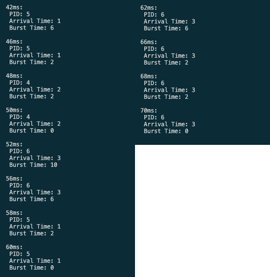
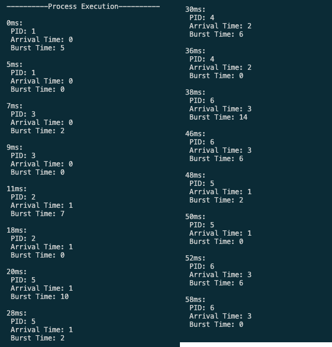
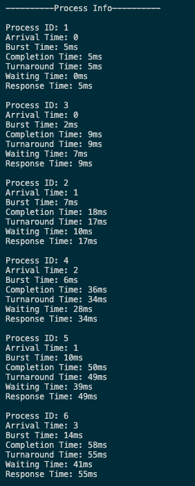
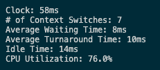
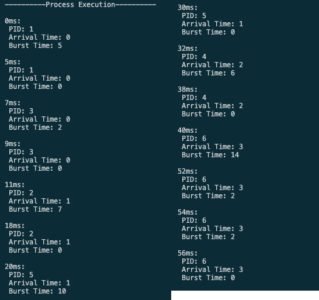
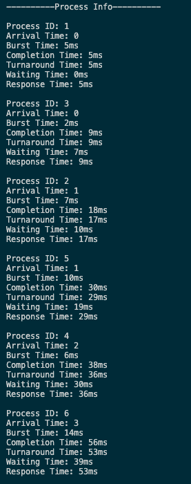
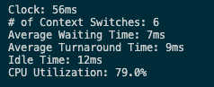

# Round Robin Scheduling

## CPU Scheduling

CPU Scheduling is the process of selecting processeses from a ready queue and allocating CPU to them. The order in which processes are selected are based off specific algorithms. For example, First Come First Serve (FCFS) where processes are processed at whichever came first.

The algorithm we are using is called Round Robin. This algorithm uses something called a time quantum, essentially a set time interval to run through processes. The processes that arrive first are given priority and run. When time quantum finishes it context switches to the next process in queue and runs the time quantum again. (Queue is sorted based off arrival time)

Our program is the simulation of this such algorithm, where you can input a list of processes and a specific time quantum for the program to run at. The program will then output a list of data such as the # of context switches, idle time, CPU utilization, and etc.

## How to run

* In command line run "java CPU.java (filename) (burst time)"
  * Default file name is processes.csv you can modify our file or drop another .csv file into the folder
  
### Examples of Execution (Our default processes.csv file)

#### Burst time of 4

* Execution

* Process Info (When a process finishes execution)

* General Info

### Burst time of 8

* Execution

* Process Info (When a process finishes execution)

* General Info

### Burst time of 12

* Execution

* Process Info (When a process finishes execution)

* General Info
